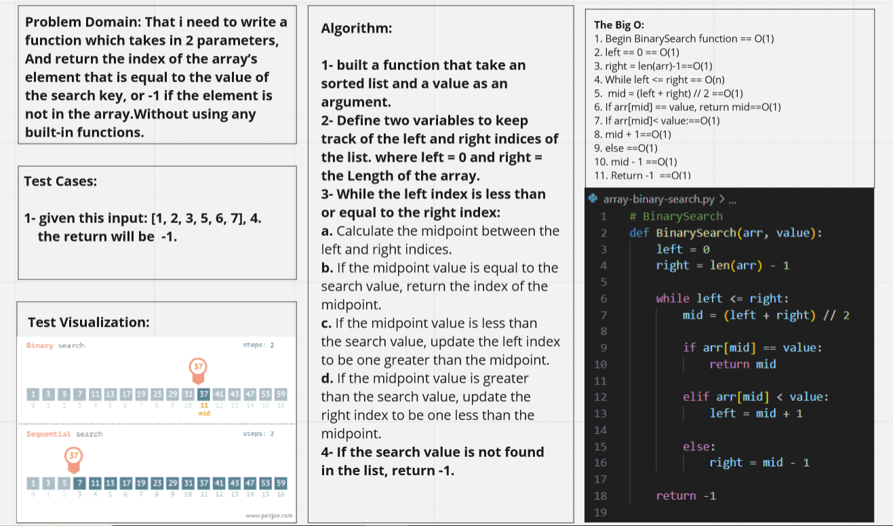
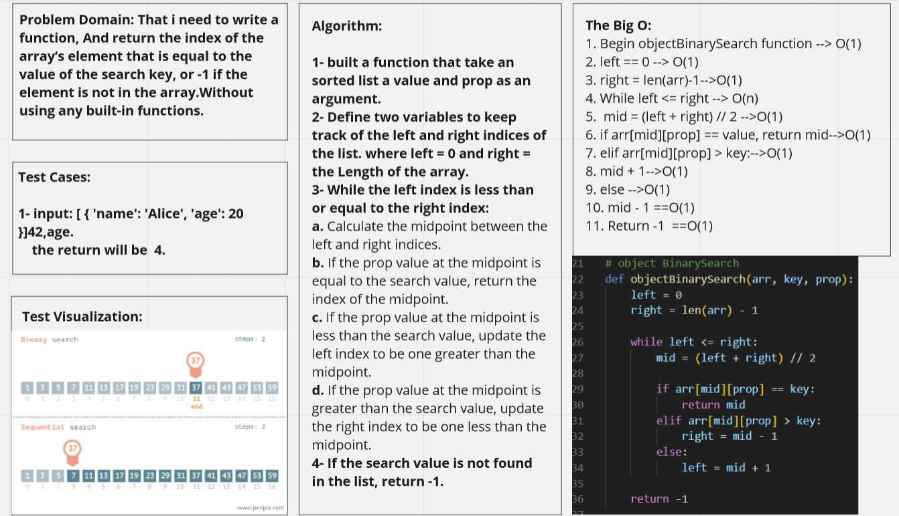

# Contributor :-
1. Driver Qais Dwairi.
2. Navigator Emman Obeidat. 

# Binary search in a sorted 1D array
**Description of the challenge**
- To create two functions, BinarySearch and objectBinarySearch. The BinarySearch function takes in a sorted array and a search key, while the objectBinarySearch function takes in a sorted array of objects, a search key, and a prop value to search for. Both functions return the index of the element that is equal to the search key or -1 if the element is not present in the array. The functions mustn't use any built-in methods available in the Python programming language.

## Whiteboard Process
**Embedded whiteboard image**

## Approach & Efficiency
**What approach did you take? Why? What is the Big O space/time for this approach?**
1. **Binary search algorithm :-**

- we first initialize two pointers, left and right, to the beginning and end of the array, respectively.
- We then enter a loop that continues as long as left is less than or equal to right.
- In each iteration of the loop, we calculate the midpoint between left and right using the formula '(left + right) // 2'.
- We then compare the value at the midpoint of the array with the number we are searching for. If the value at the midpoint is equal to that number, we return the index of the midpoint. If the value at the midpoint is greater than the number, we update right to be one less than the midpoint. Otherwise, we update left to be one more than the midpoint.
- If we reach the end of the loop and have not found the number, we return -1 to indicate that the key is not in the array.

2. **Search algorithm with arrays of objects :-**

- To work with arrays of objects that are sorted on a given property. We added an additional parameter 'property' to the BinarySearch function, which specifies the name of the property we want to search for.
- To access the property value of an object in the array, I used the square bracket notation 'arr[mid][prop]'.
- This allows us to compare the property value of the object at the midpoint of the array with the property value we are searching for.

## Solution
**Show how to run your code, and examples of it in action**
- python3 array-binary-search.py

## Resources
- [YouTube Video](https://www.youtube.com/watch?v=P3YID7liBug&t=314s).
- [YouTube Video](https://www.youtube.com/watch?v=4Q36e9EOxLU).
