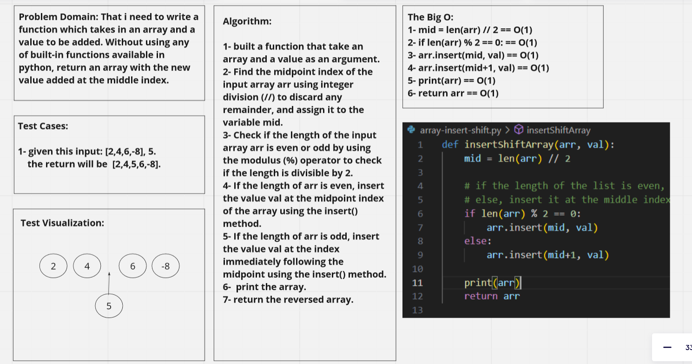

# Challenge Title
**Description of the challenge**

Wrote a function called insertShiftArray which takes in an array and a value to be added. Without using any of built-in functions available in python, return an array with the new value added at the middle index.

## Whiteboard Process
**Embedded whiteboard image**

## Approach & Efficiency
**What approach did you take? Why? What is the Big O space/time for this approach?**

- built a function that take an array and a value as an argument.
- Find the midpoint index of the input array arr using integer division (//) to discard any remainder,
  and assign it to the variable mid.
- Check if the length of the input array arr is even or odd by using the modulus (%) operator to check if the length is divisible by 2.
- If the length of arr is even, insert the value val at the midpoint index of the array using the insert() method.
- If the length of arr is odd, insert the value val at the index immediately following the midpoint using the insert() method.
-  print the array.
- return the reversed array.

## Solution
**Show how to run your code, and examples of it in action**

- puthon3 array-insert-shift.py

