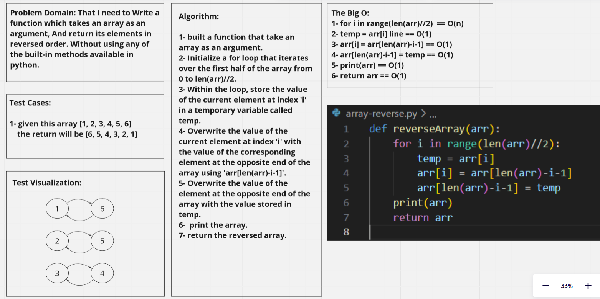

# Challenge Reverse an array.
**Description of the challenge**

Write a function which takes an array as an argument, And return its elements in reversed order. Without using any of the built-in methods available in python.

## Whiteboard Process
<!-- Embedded whiteboard image -->

## Approach & Efficiency
**What approach did you take? Why?What is the Big O space/time for this approach?**

- built a function that take an array as an argument.
- Initialize a for loop that iterates over the first half of the array from 0 to len(arr)//2.
- Within the loop, store the value of the current element at index 'i' in a temporary variable called temp.
- Overwrite the value of the current element at index 'i' with the value of the corresponding element at the opposite end of the array using 'arr[len(arr)-i-1]'.
- Overwrite the value of the element at the opposite end of the array with the value stored in temp.
- printed the array.
- return the reversed array.

## Solution
**Show how to run your code, and examples of it in action**

python3 array-reverse.py

