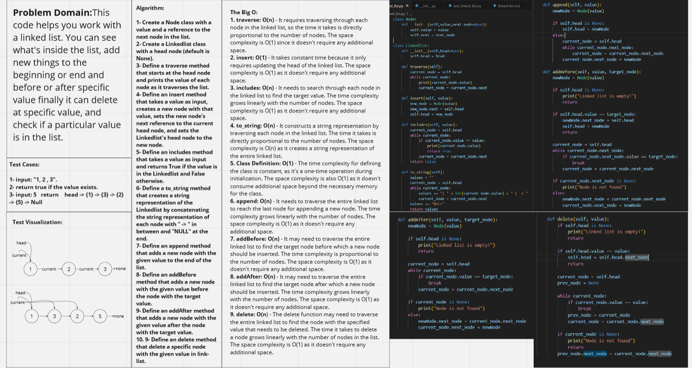
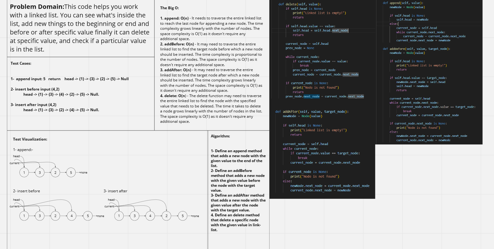
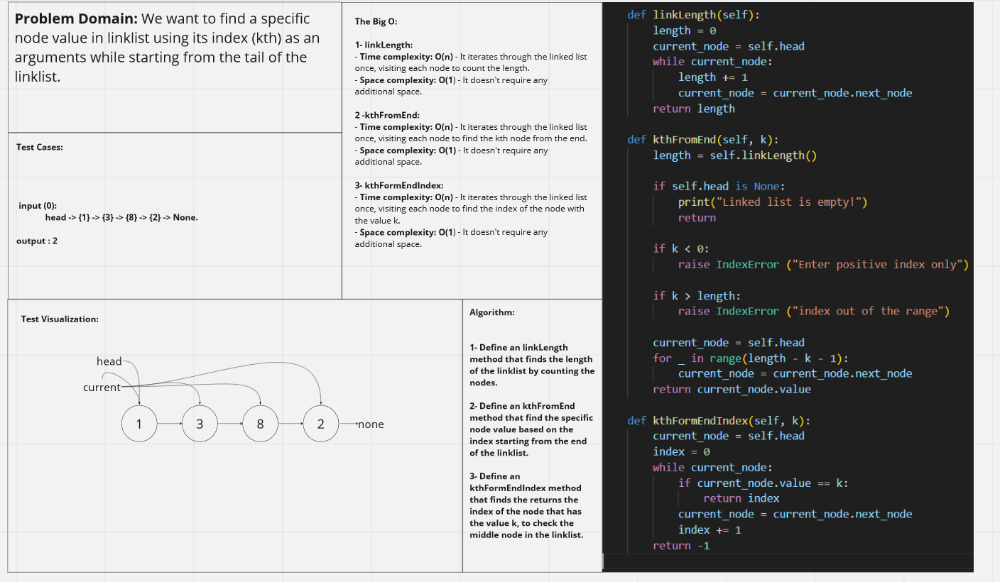
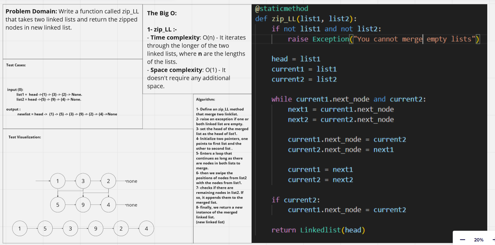

# Challenge Singly Linked Lists.
**Description of the challenge**

The challenge is to implement a Linked List class with multiple methods:

1. insert(value): Adds a new node with the given value to the head of the list in constant time (O(1)).
2. includes(value): Returns True if a node with the given value exists in the list, otherwise False.
3. to_string(): Returns a string representation of the linked list, where each node's value is enclosed in curly braces and separated by an arrow (->), ending with "NULL". For example, if the list contains nodes with values 1, 2, and 3, the to_string() method should return "head -> { 1 } -> { 2 } -> { 3 } -> NULL".
4. append(value): Adds a new node with the given value to the end of the list.
5. addBefore(value, target_node): Adds a new node with the given value before the node with the target value.
6. addAfter(value, target_node): Adds a new node with the given value after the node with the target value.
7. kthFromEnd(kth): return specific node value using the index(kth) while start from the tail.
8. zip_LL(list1,list2): return new linklist with merge nodes from two likedlists.

### ***Stretch Goal***
8. delete(value): delete a specific node with the given value. 
9. kthFormEndIndex(value): find the index of specific node in the linklist to check if its in the middle or not


## Whiteboard Process

- Singly Linked Lists

- Extend a Linked List to allow various insertion methods.

- k-th value from the end of a linked list.

- zip two linkedlists



## Solution
**Show how to run your code, and examples of it in action**
```python
pytest 
python3 linked_list.py
```
## Resources:-
1. [Delete a node in the LinkList](https://www.youtube.com/watch?v=wjW6Zhf-bqw)
2. [Inserting/Adding Elements At The End Of The Linked List (append) ](https://www.youtube.com/watch?v=o8tWJCFWEPU)
3. [Inserting/Adding Elements After The Given Node in The Linked List](https://www.youtube.com/watch?v=enRNwavYa9U)
4. [Inserting/Adding Elements Before The Given Node in The Linked List](https://www.youtube.com/watch?v=8-liQuPp34A)
5. [Find Kth or Nth from the tail Linked List](https://www.techiedelight.com/find-kth-node-from-the-end-linked-list/)
5. [Linked Lists in Detail with Python Examples: Single Linked Lists](https://stackabuse.com/linked-lists-in-detail-with-python-examples-single-linked-lists/)


